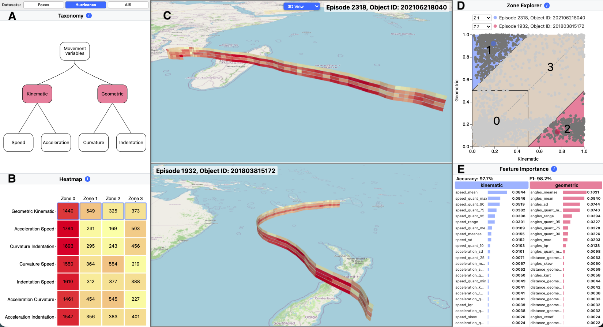

# TaxVA: A Taxonomy-Driven Visual Analytics System for Exploring Unlabeled Trajectory Data

Analyzing unlabeled movement data remains challenging, particularly when behavior emerges from complex interactions among high-dimensional features. We present TaxVA, a visual analytics system for exploratory analysis of spatio-temporal trajectories through a taxonomy-driven workflow. The taxonomy organizes movement variables into semantically meaningful groups, enabling progressive exploration of behavioral patterns. TaxVA integrates taxonomy-guided feature selection, node-specific outlier detection, zone-of-interest partitioning, supervised feature-importance analysis, and coordinated spatial visualizations. Through a use case with GPS-tracked animal movement data, we demonstrate how TaxVA supports the identification, explanation, and contextualization of movement behaviors without ground-truth labels, facilitating interpretable analysis of complex spatio-temporal data.



## Repository Status

Research Tool. 

## Requirements

- Python 3.11.X

## Installation

### 1. Create a virtual environment

**Linux / macOS**
```bash
python3.11 -m venv venv
```

**Windows**
```cmd
py -3.11 -m venv venv
```

### 2. Activate the virtual environment

**Linux / macOS**
```bash
source venv/bin/activate
```

**Windows**
```cmd
venv\Scripts\activate
```

### 3. Install Python dependencies

```bash
pip install --upgrade pip
pip install -r requirements.txt
```

## Dataset Setup

Download the datasets folder [here:](https://drive.google.com/file/d/1b71AnGo2R_4d0AimjH5_pwqxq29X7Uj5/view?usp=sharing)  

After unzipping the file above, place the folders inside `datasets/`. The resulting folder structure is the one below:

## Run the Application

```bash
python app.py
```

The server starts on [http://localhost:8000](http://localhost:8000).

## Project Structure

```text
tax-va/
├── app.py
├── requirements.txt
├── README.md
├── controllers/
│   ├── __init__.py
│   └── dataset_controller.py
├── static/
│   ├── css/
│   │   └── styles.css
│   └── js/
│       ├── main.js
│       ├── controllers/
│       │   ├── AnalysisController.js
│       │   ├── AppController.js
│       │   └── MapController.js
│       └── views/
│           ├── FeatureImportanceView.js
│           ├── Heatmap2DView.js
│           ├── HeatmapView.js
│           ├── MapView.js
│           ├── TaxonomyView.js
│           └── ZoneExplorerView.js
├── views/
│   └── templates/
│       └── index.html
└── datasets/
    ├── ais/
    │   ├── geojson/
    │   ├── ais-outlier-scores.csv
    │   ├── ais-point-feats.csv
    │   └── ais-traj-feats.csv
    ├── fox/
    │   ├── geojson/
    │   ├── fox-outlier-scores.csv
    │   ├── fox-point-feats.csv
    │   └── fox-traj-feats.csv
    └── hurricanes/
        ├── geojson/
        ├── hurricanes-outlier-scores.csv
        ├── hurricanes-point-feats.csv
        └── hurricanes-traj-feats.csv
```


## Citation / Acknowledgment

To use, modify or extend this system, you must cite the following publication. 

Cozzetti, I. A. H., Powley, B., Martins, R. M., Kerren, A., Linhares, C. D. G., & Soares, A. (2026). TaxVA: A taxonomy-driven visual analytics system for exploring unlabeled trajectory data. Under Review in MDM 2026 (Demo Track)